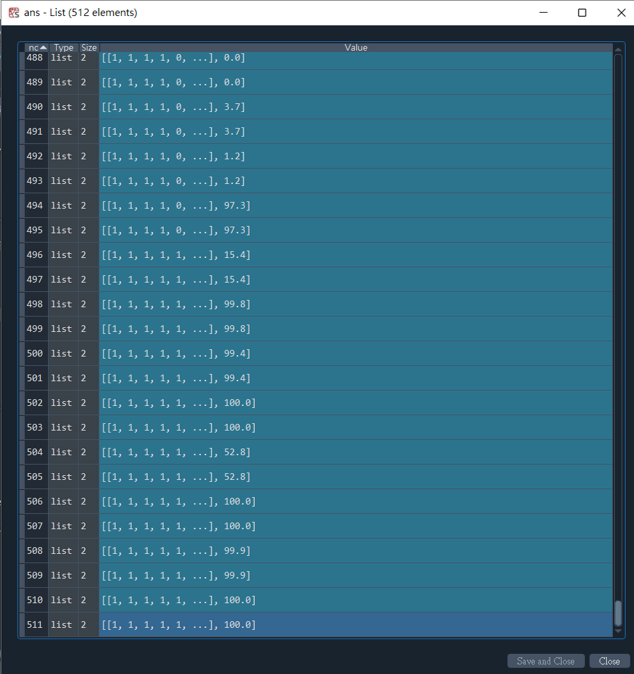

# 英雄聯盟戰績勝敗預測
## 目的
利用 Logistic Regression 模型，將9個遊戲特徵當輸入，最後預測出此場戰鬥獲勝機率。


| - | 擊殺數(K) | 死亡數(D) | 助攻數(A) | KDA (=(K+A)/D | 金錢(k) | 巴龍數 | 小龍數 | 放置偵查守衛數量 | 拆除偵查守衛數量 
|-|-|-|-|-|-|-|-|-|-
|我方資料(範例)|31|20|40|3.55|63.9|1|3|55|18
|敵方資料(範例)|19|31|30|1.58|54.1|0|2|61|14
|我方贏過敵方 yes(1) / no(0)|1|1|1|1|1|1|1|0|1
|test_data (同上)|1|1|1|1|1|1|1|0|1

附註：除了死亡數(D)欄位在數量 **我方 小於等於 敵方** 是1，其它欄位資料都是數量 **我方 大於等於 敵方** 是1

## 實驗結果(以範例資料)
Accuracy = 95.8 %
<br>
預測：100% (>= 50% 勝)
<br>
實際：勝

## 使用時機
在我方巨量優勢下，卻因某些原因導致遊戲戰敗，但不認為會輸，畢竟自己已經足夠努力。
<br>
可以利用此程式判斷在 **我方團隊經濟及遊戲狀況** 的資訊下，是否在 **過去120場世界大賽經驗** 來說真的會導致戰敗
<br>
<br>
最後如預測與事實不符合，可以合理推論，團隊中有 **單個人嚴重失誤** 或 **陣容後期不利** 而導致遊戲戰敗。

## Logistic Regression 介紹
[邏輯斯迴歸 - 維基百科](https://zh.wikipedia.org/zh-tw/%E9%82%8F%E8%BC%AF%E8%BF%B4%E6%AD%B8)
<br>
邏輯迴歸是用來處理分類問題，目標是找到一條直線可以將資料做分類。主要是利用 sigmoid function 將輸出轉換成 0~1 的值，表示可能為這個類別的機率值

## 如何使用
在 LogisticRegression.py 檔案內，修改 test_data list 內容，然後執行程式。
```python
# 修改處
test_data = [1,0,1,0,1,0,1,0,1] 
print()
print(str(test_data), ":", round(predict(beta, test_data) * 100, 1), "%", end=' ')
if predict(beta, test_data) >= 0.5:
    print("勝")
else:
    print("敗")
```

## 測試資料如何取得(範例舉例)
### 計分板

### 資訊


## 其餘資訊
在不同排列組合下，機率皆異，供參考
<br>
